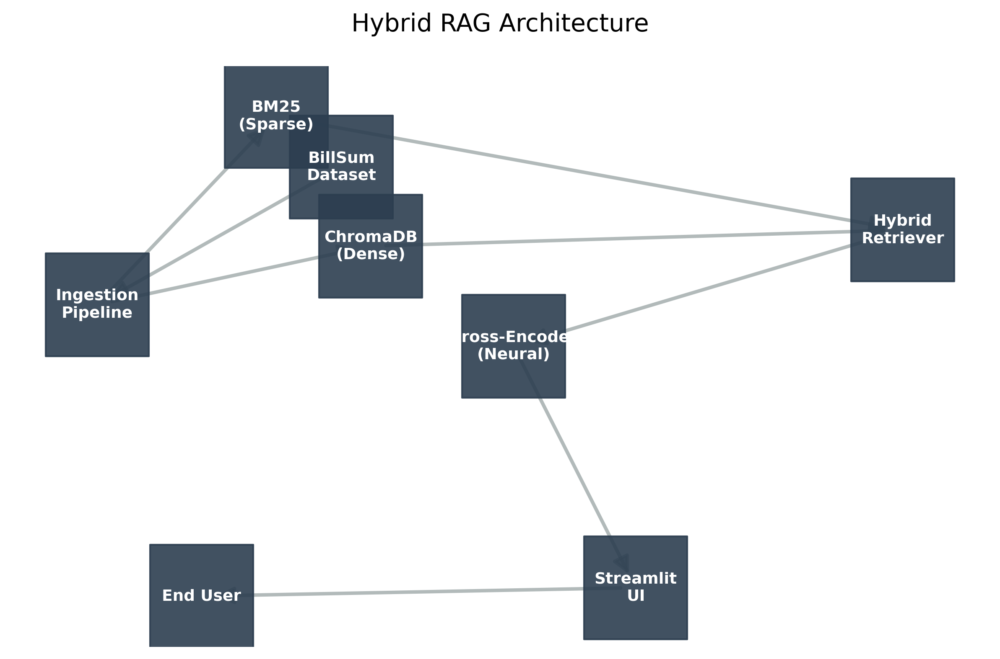
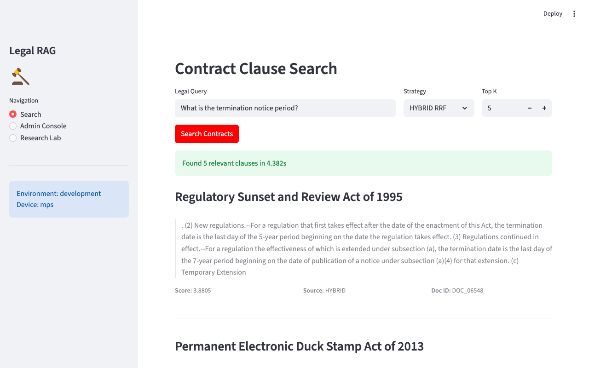

# Legal Document Search with RAG

A retrieval-augmented generation system for legal contract analysis. Combines vector search with BM25 keyword matching (fused via Reciprocal Rank Fusion) and cross-encoder re-ranking to improve precision on specific legal clauses.

**Stack:** Python, LangChain, ChromaDB, BM25, Sentence-Transformers, Cross-Encoders (ms-marco), Streamlit



## The Problem

Legal queries like "What is the termination notice period?" need two types of search:
1. Semantic understanding — finding concepts like "end of agreement" (vector search)
2. Exact keyword matching — finding terms like "30 days" or "Section 8.1" (BM25)

A pure vector database misses keyword constraints. The hypothesis was that a hybrid approach with RRF fusion and neural re-ranking would outperform dense-only retrieval.

## Benchmark Results (A/B Test)

We tested using a golden set of 20 complex legal queries against the BillSum (US Legislation) dataset [1].

The hybrid architecture showed a ~6.6% improvement in Mean Reciprocal Rank and achieved 100% Hit Rate:

| Metric | Baseline (Dense Only) | Hybrid + Rerank | Improvement |
| :--- | :--- | :--- | :--- |
| MRR (Rank Precision) | 0.8833 | 0.9417 | +6.6% |
| Hit Rate @ 5 | 95.0% | 100.0% | +5.3 pts |
| NDCG @ 5 | 0.9000 | 0.9565 | +6.3% |


> Hybrid search introduced a latency overhead (534ms vs 340ms), but the accuracy gain was deemed critical for the legal domain.

## How It Works

### Ingestion
- ETL pipeline with validation, deduplication, and dual-indexing
- Regex pipeline for cleaning OCR artifacts (headers, broken hyphens, redactions)
- Logs every document event to `logs/ingestion_audit.csv`
- Simultaneously builds a ChromaDB (dense) and BM25 (sparse) index

### Retrieval
- Implements Reciprocal Rank Fusion (RRF) to merge vector and keyword scores
- Uses a ms-marco-MiniLM cross-encoder to re-rank the top 50 fused candidates
- Singleton pattern ensures models are loaded once and shared across threads

### Evaluation
- Runs the A/B test pipeline
- Programmatically generates the architecture diagrams and heatmaps using NetworkX and Seaborn

## How to Run

### 1. Install dependencies
```bash
pip install -r requirements.txt
```

### 2. Run ETL pipeline
Downloads the BillSum dataset and builds the indices:
```bash
python main.py ingest --limit 0
```

### 3. Run benchmark
Executes the A/B test and regenerates the assets:
```bash
python main.py benchmark
```

### 4. Launch the dashboard
```bash
python main.py ui
```



---

Requires Python 3.11.

**References**

[1] Etsuko Ishii, "BillSum: A Corpus for Generative Summarization of US Legislation", The Atticus Project, 2019. Available on Hugging Face: billsum.
